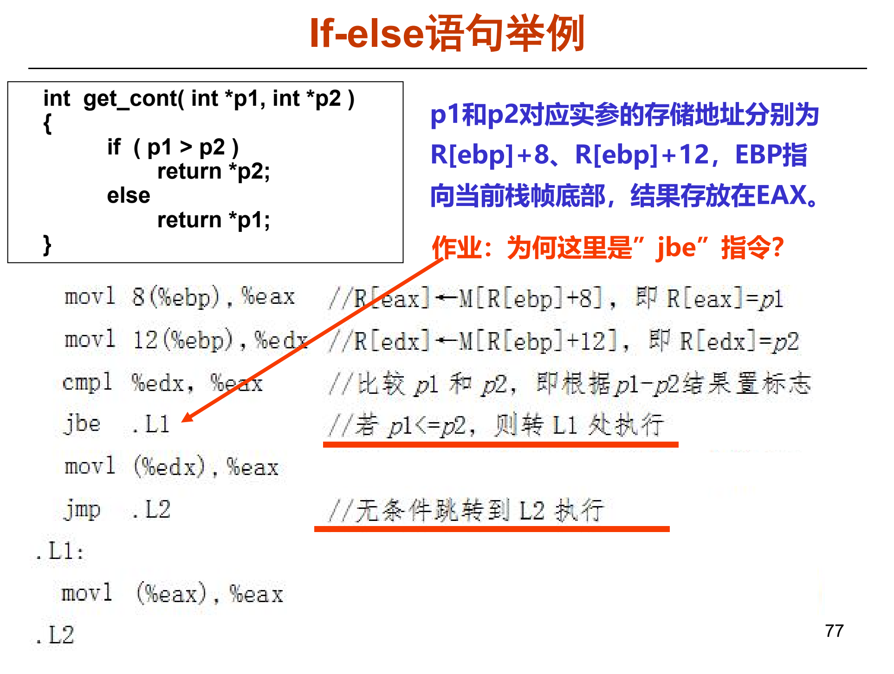
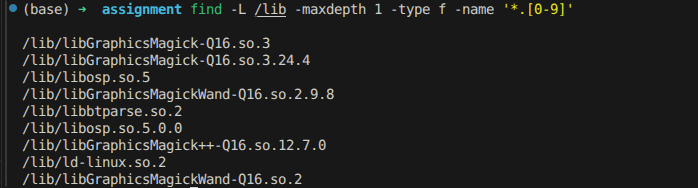

# 平时作业 2

> 学号：2312236 	姓名：付家权
>

## 目录

[TOC]

## 问题 1：`p1 > p2` 为何生成 `jbe`？

题目中的 C 代码如下：

```c
int get_cont(int *p1, int *p2)
{
    if (p1 > p2)
        return *p2;
    else
        return *p1;
}
```

对应示意图如下：



从源程序看，条件表达式是 `p1 > p2`，直观上似乎应该生成表示“大于则跳转”的指令。但实际生成的汇编代码如下：

```asm
movl 8(%ebp), %eax     # eax = p1
movl 12(%ebp), %edx    # edx = p2
cmpl %edx, %eax        # 比较 p1 和 p2
jbe .L1                # 若 p1 低于或等于 p2，则跳到 .L1
movl (%edx), %eax      # p1 > p2 时，返回 *p2
jmp .L2
.L1:
movl (%eax), %eax      # p1 低于或等于 p2 时，返回 *p1
.L2:
```

这里生成 `jbe` 的原因主要有两个。

第一，编译器不一定按照源代码中的条件正向生成跳转。源程序的逻辑是：

```text
如果 p1 > p2，返回 *p2；
否则，返回 *p1。
```

编译器可以将其改写为等价的控制流：

```text
如果 p1 <= p2，跳到 else 分支；
否则继续执行 then 分支。
```

因此，`jbe .L1` 的含义不是 “`p1 > p2` 时跳转”，而是 “`p1 > p2` 不成立时跳转”。具体来说：

```text
p1 <= p2 时，跳到 .L1，执行 return *p1；
p1 > p2 时，不跳转，顺序执行 return *p2。
```

第二，`jbe` 是无符号比较中的 “below or equal”，即 “低于或相等则跳转”。指针保存的是地址值，进行地址大小比较时通常按无符号数处理。因此，`p1 <= p2` 对应的条件跳转是 `jbe`。这里不能把 `jbe` 理解为有符号数中的 “less or equal”，因为有符号比较和无符号比较使用的条件跳转指令不同。

还要注意 AT&T 汇编中 `cmp` 的操作数顺序。指令：

```asm
cmpl %edx, %eax
```

实际比较的是：

```text
%eax - %edx
```

也就是比较 `p1 - p2`。`cmpl` 本身不保存减法结果，但会根据减法结果设置 CPU 的标志位。随后 `jbe` 根据这些标志位判断是否跳转：当 `CF == 1` 或 `ZF == 1` 时，`jbe` 发生跳转。其中，`CF` 表示无符号减法发生借位，对应 `p1` 低于 `p2`；`ZF` 表示结果为 0，对应 `p1` 等于 `p2`。因此，`jbe` 判断的整体条件就是无符号意义下的 `p1 <= p2`。

综上，虽然 C 代码中写的是 `p1 > p2`，但编译器选择了判断它的反条件 `p1 <= p2` 来跳到 `else` 分支；由于指针地址按无符号方式比较，所以生成了表示 “低于或相等则跳转” 的 `jbe` 指令。

------

## 问题 2：`/lib/ld-linux.so.2` 中 `.2` 的含义

`/lib/ld-linux.so.2` 是 Linux 32 位 ELF 程序常见的动态链接器，也称为动态加载器。程序启动时，内核会根据 ELF 文件中的解释器路径找到它，再由它负责加载程序依赖的共享库，例如 `libc.so.6`。

这个名字可以拆开理解：

```text
/lib/ld-linux.so.2
```

其中：

```text
ld-linux    表示 Linux 下的动态链接器/加载器
.so         表示 shared object，即共享对象
.2          表示 glibc 2 系列 32 位 ELF 动态链接器的 ABI/接口版本
```

因此，这里的 `.2` 不是普通文件扩展名，也不是表示“第二个文件”，而是一个具体的 ABI 版本标识。`ld-linux.so.2` 表示 glibc 2 系列为 32 位 ELF 程序提供的动态链接器。32 位程序的 ELF 文件中通常会在 `PT_INTERP` 段记录解释器路径，例如 `/lib/ld-linux.so.2`。内核启动程序时，会按照该路径找到对应的动态加载器。

共享库文件名中经常包含类似的主版本号，例如：

```text
libc.so.6
libm.so.6
ld-linux.so.2
```

这些尾部数字主要用于区分 ABI 兼容性。只要 ABI 兼容，库的内部实现可以升级，但对外仍保持同一个主版本号；如果 ABI 发生不兼容变化，主版本号通常需要改变。

Linux 共享库还常使用 SONAME 机制。SONAME 可以理解为程序运行时依赖的共享库名字，通常只包含主版本号，例如 `libxxx.so.2`。磁盘上实际存在的文件可能是更具体的版本，例如 `libxxx.so.2.3.4`，而 `libxxx.so.2` 往往是一个符号链接，指向具体版本文件。这样程序在加载共享库时只需要寻找 ABI 兼容的大版本号，不必关心具体的补丁版本。

`/lib/ld-linux.so.2` 也体现了类似思想。它提供一个稳定的动态链接器名字，具体含义是 “glibc 2 的 32 位 Linux ELF 动态加载器”。系统内部可以把这个名字链接到实际安装的动态加载器文件。例如当前系统中：

```text
/lib/ld-linux.so.2 -> ../lib32/ld-linux.so.2
```

也就是说，程序使用的是稳定的 `/lib/ld-linux.so.2` 路径，而系统通过符号链接将其指向实际安装的 32 位动态加载器。只要 ABI 兼容，程序就可以正常启动。

可以通过下面的命令查找 `/lib` 目录下名字以 `.数字` 结尾的文件：

```bash
find -L /lib -maxdepth 1 -type f -name '*.[0-9]'
```

这里使用 `-L` 是因为在现代 Linux 发行版中，`/lib` 往往是指向 `/usr/lib` 的符号链接。如果不加 `-L`，`find` 可能只看到 `/lib` 这个符号链接本身，而不会进入它指向的真实目录；加上 `-L` 后，`find` 会跟随符号链接继续查找。

实际执行结果如图 2 所示：



对应输出为：

```text
/lib/libGraphicsMagick-Q16.so.3
/lib/libGraphicsMagick-Q16.so.3.24.4
/lib/libosp.so.5
/lib/libGraphicsMagickWand-Q16.so.2.9.8
/lib/libbtparse.so.2
/lib/libosp.so.5.0.0
/lib/libGraphicsMagick++-Q16.so.12.7.0
/lib/ld-linux.so.2
/lib/libGraphicsMagickWand-Q16.so.2
```

从输出可以看到，系统中不仅有 `/lib/ld-linux.so.2`，还有很多类似 `libxxx.so.主版本号` 或 `libxxx.so.主版本号.次版本号.修订号` 的共享库文件。这说明尾部数字在共享库命名中很常见，主要用于表示版本和 ABI 兼容关系。

对 `/lib/ld-linux.so.2` 来说，`.2` 具体表示 glibc 2 系列的 32 位动态链接器接口，而不是任意库的泛泛版本号。32 位 Linux 程序在 ELF 头部的 `PT_INTERP` 段中可能直接记录这个路径，所以系统需要提供这个名字，使旧程序和现有程序都能找到 ABI 兼容的动态加载器。

综上，`/lib/ld-linux.so.2` 中的 `.2` 具体表示 glibc 2 系列 32 位 ELF 动态链接器的 ABI/接口版本。它的作用是给 32 位 ELF 程序提供一个稳定的动态加载器路径，用来保证程序启动时能找到兼容的动态链接器。
